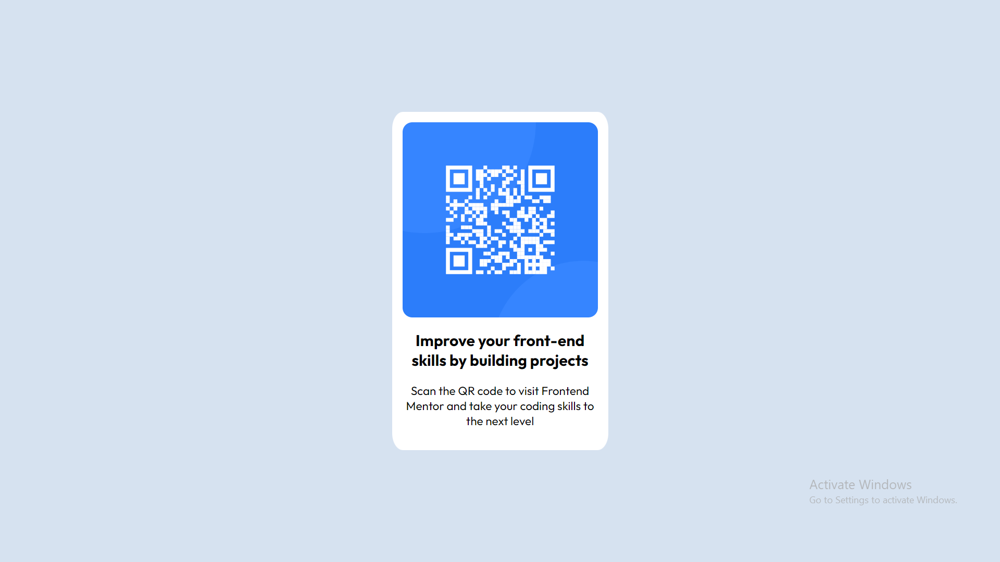
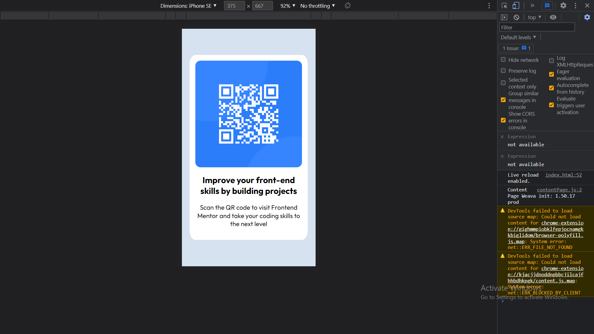

# QR-Card
This is My (FrontendMentor.com) First Solution
# Frontend Mentor - QR code component solution

This is a solution to the [QR code component challenge on Frontend Mentor](https://www.frontendmentor.io/challenges/qr-code-component-iux_sIO_H). Frontend Mentor challenges help you improve your coding skills by building realistic projects. 

## Table of contents

- [Overview](#overview)
  - [Screenshot](#screenshot)
  - [Links](#links)
  - [My process](#my-process)
  - [Built with](#built-with)
  - [What I learned](#what-i-learned)
- [Author](#author)
- [Acknowledgments](#acknowledgments)

## Overview
  Frontendmentor is the best place to learn Web development and build from basic to advanced project and fundamentals strong..
  
### Screenshot




### Links

- Live Site URL: [https://kirankumarrajput.github.io/QR-Card/](https://kirankumarrajput.github.io/QR-Card/)

## My process

Structure using HTML and styling using the css that sit.

### Built with

- Semantic HTML5 markup
- CSS custom properties
- Flexbox
- CSS Grid
### What I learned

```html
section and div work differently
```

## Author

- [Kiran kumar]
- [@kirankumarrajput](https://www.frontendmentor.io/profile/kirankumarrajput)


## Acknowledgments

Sometime a stuck in css someone who guide me..


